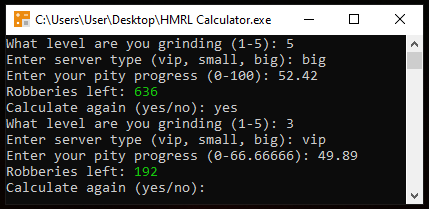

# How Many Robberies Left Calculator for Jailbreak
## How to use
1. Download HMRL Calculator.exe
2. Open the file
3. Choose your current grinding level (1-5)
4. Choose your server type (vip, small, big)
5. Enter your current progress shown in the game, based on the server type where you got it
6. Get the result

## Source Code
You can check the code by downloading the .ps1 file
The .exe version is just a easier way to run it
## Calculation Logic
The calculator uses this formula to count your progress

LeftRobberies = (MaxPity - CurrentPity) / PityPerRobbery

The result depends on the server type — Big server (MaxPity = 100) or Small/VIP server (MaxPity = 66.66666)
If you reach 66.66666% pity on a Small/VIP server and then join a Big server, your pity gets multiplied by 1.5, which brings it up to 100%

*Created by Claude and s1rgei*
