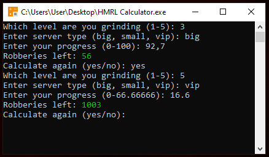
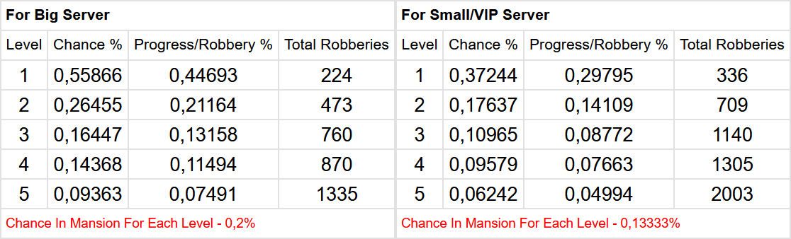

# How Many Robberies Left Calculator for Jailbreak
## How to use
1. Download HMRL Calculator.exe
2. Run the file
3. Choose your current grinding level (1-5)
4. Choose server type (big, small, vip)
5. Enter your current progress shown in the game, based on the server type where you got it
6. Get the result

## Source Code
You can check the code by downloading the .ps1 file
The .exe version is just a easier way to run it
## Calculation Logic
The calculator uses this formula to calculate your progress

LeftRobberies = (MaxProgress - CurrentProgress) / ProgressPerRobbery

The result depends on the server type - Big server (MaxProgress = 100) or Small/VIP server (MaxProgress = 66.66666)
If you reach 66.66666% on a Small/VIP server and then join a Big server, your progress gets multiplied by 1.5, which brings it up to 100%

*Created by Gemini and s1rgei*

Also you can use this table

